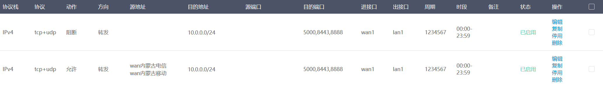
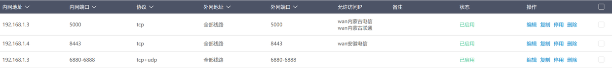

## 关键词

爱快 IKUAI 防火墙 ACL 封禁 恶意IP 限制 来源IP 访问IP SSH WEBUI 远程控制 RDP

## 背景
我们转发了端口到公网的人都会面临一个难题，比如转发Windows的远程控制RDP，比如NAS的SSH服务或者其他WEBUI服务，老是有许多恶意IP来探测并尝试爆破。诚然，比如群晖会自带防火墙，Linux也可以使用fail2ban或者其他防火墙来实现自动封禁恶意IP，这些都是有效的手段。

不过这里想要说明的是，以爱快作为主路由时一个更好的保护方式，就是充分利用爱快的IP分组，结合端口转发功能或ACL功能来实现。

## 流程

- 下载（或者点击文件右上角的`Copy raw content`按钮复制下来保存为`csv`文件） [这个](https://github.com/devome/files/blob/master/ikuai/ipgroup.csv) 文件（不定期更新），在爱快设置中 `网络设置 -> 终端分组设置 -> IP分组`处导入。

- 使用`安全设置 -> ACL规则`，参考下面的方式，允许你所在地区的对应的运营商的IP转发到你所使用的端口，而阻断其他所有IP访问对应的端口。**注：图中并未填目的地址，建议填一下对应设备的局域网地址。进接口可以选择对应的wan口，出接口可以选择对应的lan口。**

- 某些旧版本爱快的acl功能可能是失效的（你可以自行测试，比如阻断你所在省份后手机使用蜂窝网访问），这时只能在`网络设置 -> 端口映射 -> 端口映射`处，给每一条需要限制访问来源IP的条目选择对应的IP分组。

## 说明

1. ACL功能失效的时候，使用端口映射功能来限制时，每一条需要限制访问来源的条目需要分别设置，所以需要限制的端口和不需要限制的端口需要分成两条；
2. 需要限制访问来源的服务一般是WEBUI、RDP、SSH等（基本上都是tcp协议），像BT/PT软件（uTorrent, qBittorrent, transmission, deluge等等）等P2P的监听端口（tcp+udp协议）就不要限制访问来源IP；
3. 爱快路由器自己的WEBUI端口不要限制，要不然万一你IP不在允许范围内，改都都不了；
4. 建议允许访问的来源IP都选上`未知`的IP分组，尤其是中国移动，除了选择你所在省份，一定要选上`未知移动`。

## IPv6

IPv6的ACL设置请在 [这里](https://www.jianshu.com/p/c762ead45eb2) 查看。